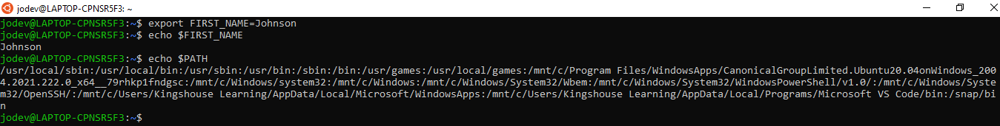
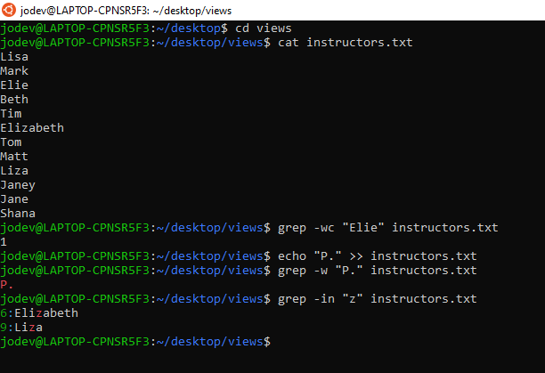

# Enviroment Process and Finding
## Part I

1. Create an environment variable called `FIRST_NAME` and set it equal to your first name (this does not need to be permanent)
2. Print the `FIRST_NAME` variable
3. Print out the `$PATH` variable

4. What is the `$PATH` variable?

    Is used to fine programs to be executed. It is an enviroment variable

5. Why would you want to create an environment variable?

    We can create an enviroment variable to access an information from any path, to store, make refrence and use a particular information severally.

6. How do you permanently save environment variables?

    By inputing the command into the configuration file which could be `.zshrc`, `.bash-profile and` `.bashrc`

7. What is a process?

    A process is a current running program

8. How do you list all processes running on your machine?
    By using `ps aux` command

9. What is a PID?

    Stands for Process ID is used to give a process an identity 

10. How do you terminate a process?

    Either by using `kill` or `kill -9`

11. What is the difference between `kill` and `kill -9`?

    `kill` uses thr `TERM` signal which may not be effective on crashed or frozen software process but `kill -9` uses the `KILL` signal which indicate a an non-catchable, non-ignorable termination.

12. What `grep` flag allows for case insensitive search?
    `-i`

13. What `grep` flag allows for a certain number of lines before the match?
    `-B`

14. What `grep` flag allows for a certain number of lines around the match?
    `-C`

15. What `grep` flag allows for a certain number of lines after the match?
    `-A`
16. What `grep` flag allows for full word search?
    `-w`

17. What `grep` flag shows you the line number of a match?
    `-n`

## Part II

1. Find all files inside the `Desktop` folder that have a name of "learn."
2. Find all files inside the `Desktop` folder that start with a "P."
3. Find all files inside the `Desktop` folder that end with `.txt`.
4. Find all files inside the `Desktop/views` folder that have the name `data` somewhere in their filename.

5. Inside of the `instructors.txt` file, output the number of times the word "Elie" appears.
6. Inside of the `instructors.txt` file, list all matches for any full word that starts with a capital "P."
7. Inside of the `instructors.txt` file, list all the line numbers for any full word that starts with a "z" (it should match regardless of upper or lower case).

