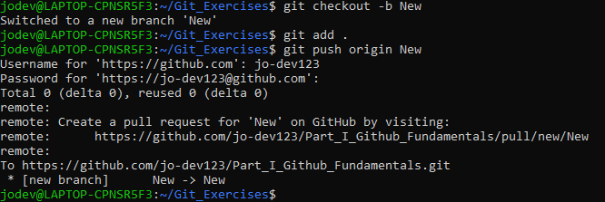

# Part I

1. Create a local repository and add and commit some files


2. Create a remote repository and push your code from the local repo to the remote
* Visit your Git Account
* Create Remote Repo by visiting   [https://github.com/new](https://github.com/new/)
* Create a repo name
* add the following to you local directory to connect to your remote
```
    git remote add origin https://github.com/jo-dev123/Part_I_Github_Fundamentals.git
    git branch -M main
git push -u origin main
```

3. Fork the repo [https://github.com/inf-paces/git_practice](https://github.com/inf-paces/git_practice) - clone it and submit a pull request

* Get to the repo
* Fork it by clicking on the fork repo 
* Clone it to your local repo
4. Create a new branch locally and push it to GitHub

  

5. Submit a pull request with your new branch against the master branch on the git_practice repo.
* Click on Pull Request on the Branch

