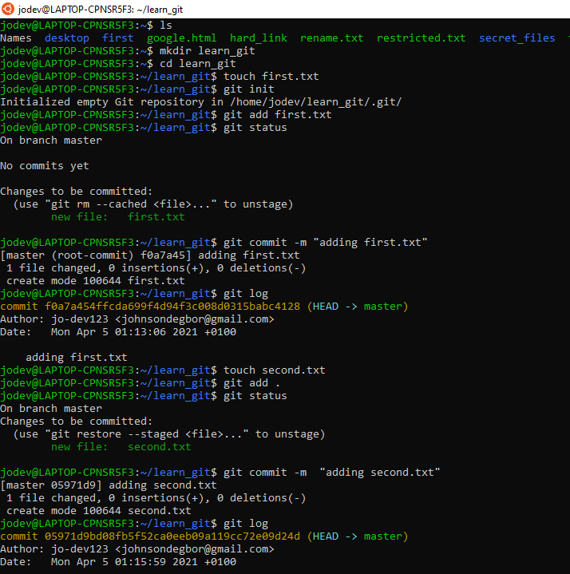
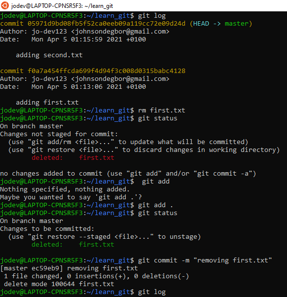
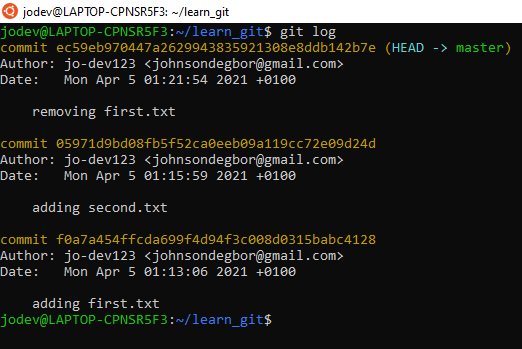

# Your turn
## complete these steps:

1. Create a folder called `learn_git`. (Make sure you do this from a folder that isn't a git repository!)
2. `cd` into the `learn_git` folder.
3. Create a file called `first.txt`.
4. Initialize an empty git repository.
5. Add `first.txt` to the staging area.
6. Commit with the message "adding first.txt".
7. Check out your commit with `git log`.
8. Create another file called `second.txt`.
9. Add `second.txt` to the staging area.
10. Commit with the message "adding second.txt".
11. Remove the `first.txt` file.
12. Add this change to the staging area.
13. Commit with the message "removing first.txt".
14. Check out your commits using `git log`.

**Process in image below**

