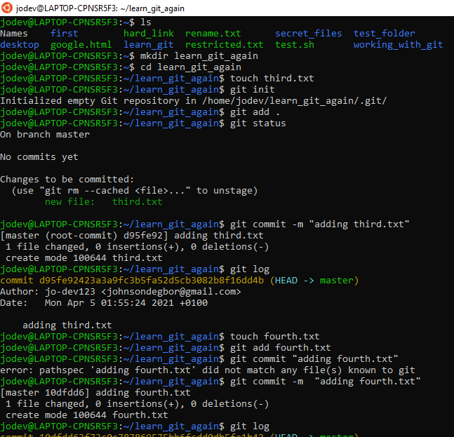
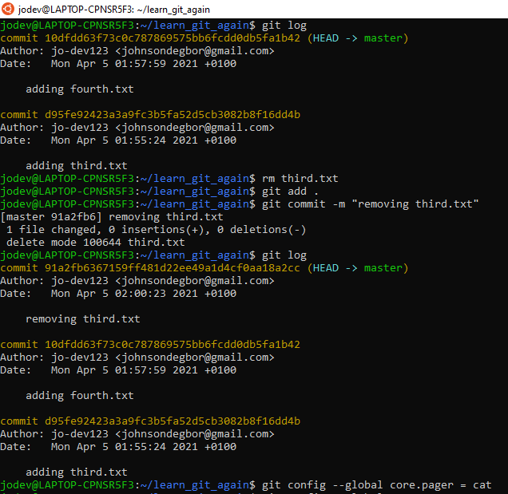
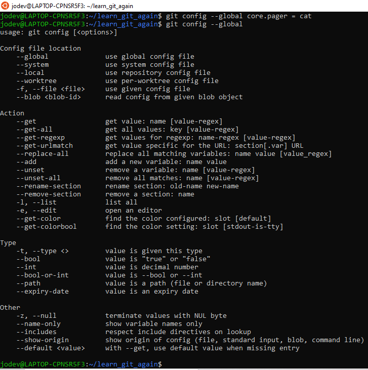

# Git Basics Exercises

1. Create a folder called `learn_git_again`.
2. cd into the `learn_git_again` folder.
3. Create a file called `third.txt`.
4. Initialize an empty git repository.
5. Add `third.txt` to the staging area.
6. Commit with the message **"adding third.txt"**.
7. Check out your commit with `git log`.
8. Create another file called `fourth.txt`.
9. Add `fourth.txt` to the staging area.
10. Commit with the message **"adding fourth.txt"**
11. Remove the `third.txt` file
12. Add this change to the staging area
13. Commit with the message **"removing third.txt"**
14. Check out your commits using `git log`
15. Change your global setting to `core.pager=cat` - you can read more about that here.
16. Write the command to list all of the global configurations for git on your machine. You can type git `config --global` to find out how to do this.

**Answers and process in Image below**

