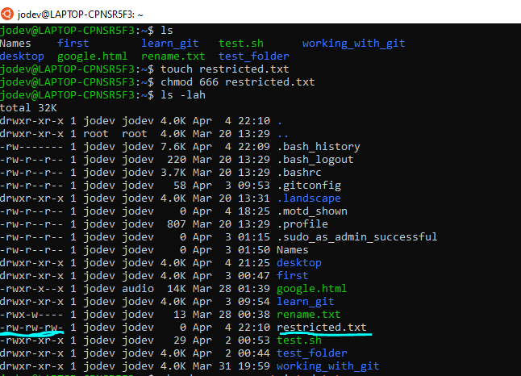
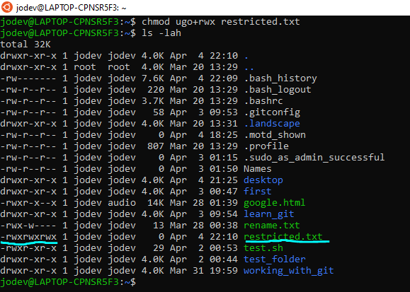
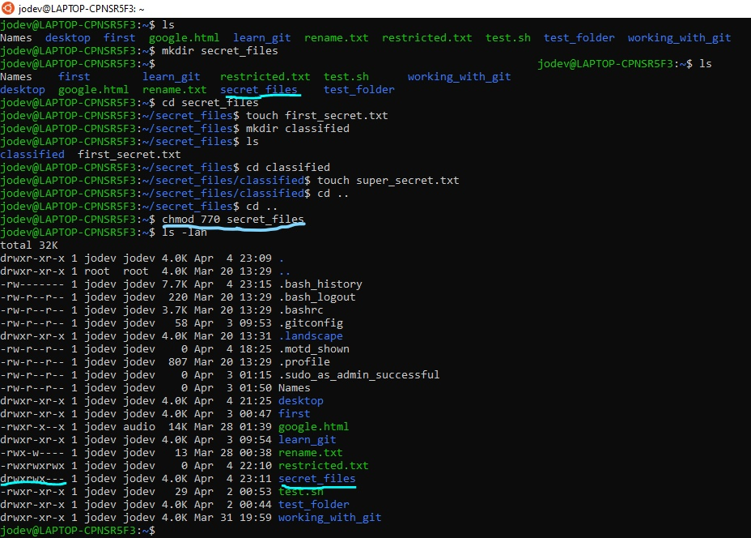
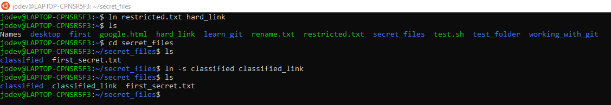
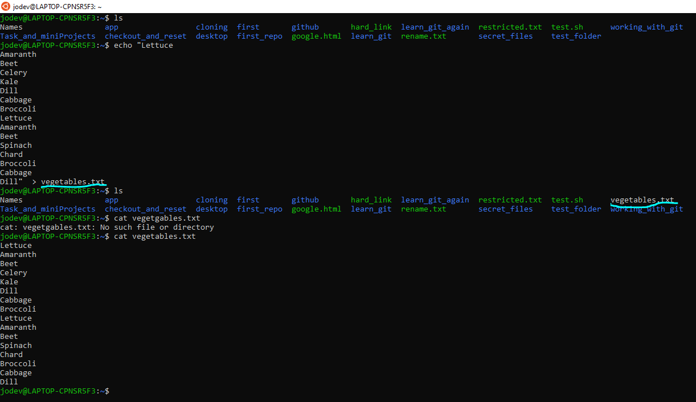
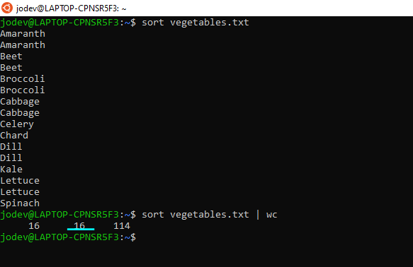
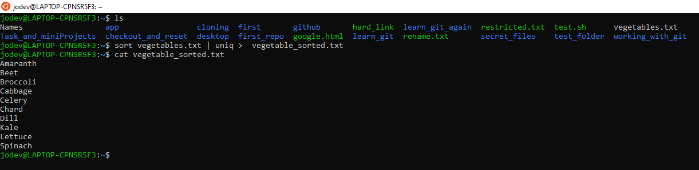
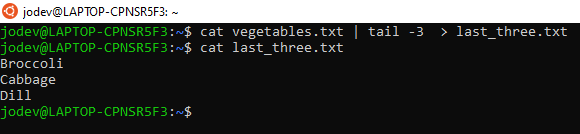
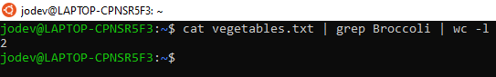

# Permission, Redirection and Piping

1.	Create a file called `restricted.txt`

2.	Change the permissions on the      `restricted.txt` file to allow the owner to “read and write” to the `restricted.txt` file. Do this using the **Octal Notation**





3.	Change the permissions on the `restricted.txt` file to only allow the owner, group and everyone to “read and write and execute” the `restricted.txt` file. Do this using the **Symbolic notation**.



4.	Create a folder called `secret_files`. Inside the `secret_files` folder create a file called `first_secret.txt` and another folder called `classified`. Inside of the `classified folder` create a file called `super_secret.txt`.

5.	Change the permissions on the `secret_files` to only allow the owner and group to read, write and execute in all the files and folders inside of `secret_files`. Do this using the **Octal Notation**.



6.	Create a hard link for the `restricted.txt` called `hard_link`.
7.	Create a symbolic link for the `classified` folder called `classified_link`.




## Part II

**For the following exercises, create a text file called vegetables.txt with the following text:**

```
Lettuce
Amaranth
Beet
Celery
Kale
Dill
Cabbage
Broccoli
Lettuce
Amaranth
Beet
Spinach
Chard
Broccoli
Cabbage
Dill
```



_Write the following terminal commands to do the following_

1.	Sort `vegetable.txt`.
2.	Count the number of lines in `vegetable.txt`.

    

    **_Based on the image above it consist of 16 lines_**

3.	Create a file called `vegetable_sorted.txt` which contains all the unique vegetables sorted in ascending order in `vegetable.txt` (do this without the touch command).



4.	Create a file called `last_three.txt` which contains the last three vegetables in the `vegetable.txt` file (do this without the touch command).



5.	Count the number of lines the word "Broccoli" appears on (using `wc` and `grep`).



