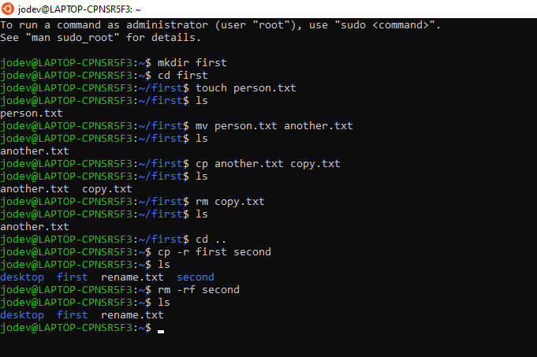
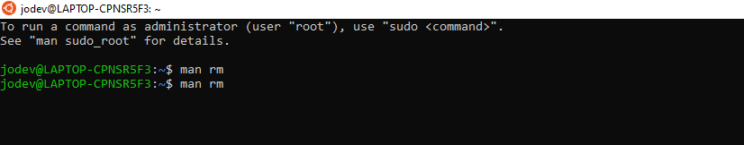
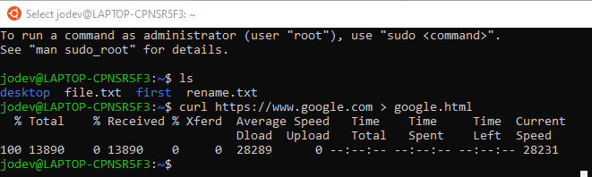
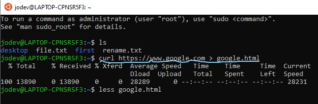
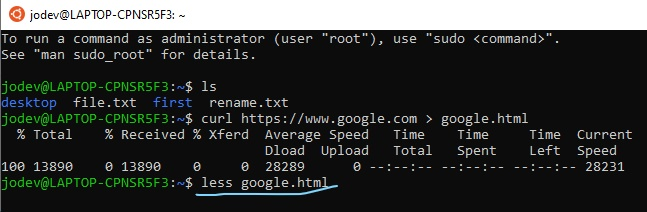
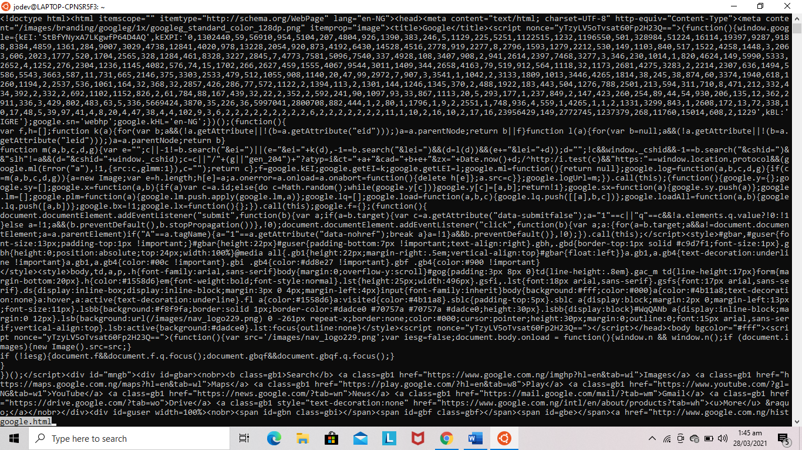
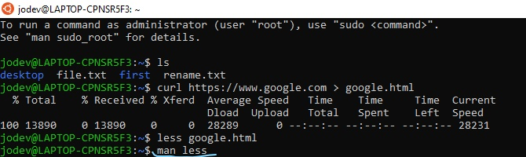
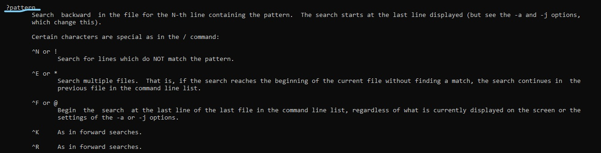
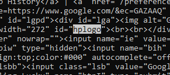

# Terminal Basics Excercises

## Part I

1. make a directory called `first`
2. change directory to the `first` folder
3. create a file called `person.txt`
4. change the name of `person.txt` to `another.txt`
5. make a copy of the `another.txt` file and call it `copy.txt`
6. remove the `copy.txt` file
7. make a copy of the `first` folder and call it `second`
8. delete the `second` folder

## Part II

1.	**What does the `man` command do? Type in `man rm`. How do you scroll and get out?**
The `man` command is used to open the user manual and can give details
on a particular command, usually this command follows the man command.

    - _Type in `man rm`_

        _input_
        

        _output_
        

    - _How do you scroll and get out?_

        To scroll we use our `up and down arrows` for direction on the keyboard.
To quit letter `q` is used

2. **Look at the `man` page for `ls`. What does the `-l` flag do? What does the `-a` flag do?**

    The `-l` flag uses `-a` long listing format
    The `-a` flag makes does not ignores entries starting with `.` and thereby revealing hidden files and directories.

3. **Type the following command to download and save the contents of google.com: `curl` [https://www.google.com](https://www.google.com) `> google.com`** 

4.	**Use less to look at the contents of `google.html`**

    _input_
        

    _output_
        

5.	**Look at the `man` page for `less`. Read the section on `/pattern`. Search for the text `hplogo` in the `google.html` file.**

    - _`man` page for less_

        _man less_
        
    - _Read the section on `/pattern`_

        _`pattern`_
        
        
    - _Search for the text `hplogo` in the `google.html` file_
        _

        _Search `hplogo`_

        

6.	**How do you jump between words in the terminal?**

    Using the `alt + left` or `alt + right` keys

7.	**How do you get to the end of a line in terminal?**

    Using the `Control + E` also `Ctrl + E`

8. |**How do you move your cursor to the beginning in terminal?**

    Using `Control + A` also `Ctrl + A`

9. **How do you delete a word (without pressing backspace multiple times) in terminal?**

    Using `Alt + Delete`

10. **What is the difference between a terminal and shell?**

    **_Shell_** is a program that responsible for processing and executing command to give output

    **_Terminal_** is a wrapper program that runs the shell that actually processes command

11. **What is an absolute path?**

    Absolute paths start its path from the root directory in the terminal the usually start with a forward slash (/) sign. 
12.	**What is a relative path?**

    A Relative Path is a path that starts from the current active location

13.	**What is a flag? Give three examples of flags you have used.**

    A flag can be used to enhance the function of a command.

    _Three of flags I have used:_
    
    - `-r` flag for _recursive_
    - `-h` flag for _viewing file size_
    - `-p` for _using `pattern` to find content in a file_

14. **What do the `r` and `f` flags do with the `rm` command?**
    `r` flag in the `rm` goes through all files in the folder **recursively**
    `f` flag in the `rm` command removes the folder **forcefully**.

