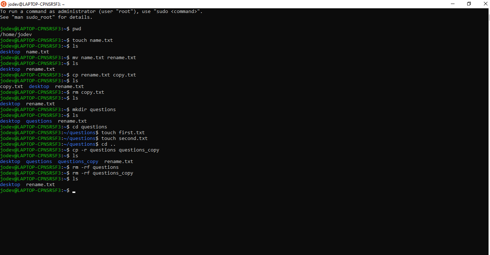

### Exercise

1. Create a file called `name.txt`.
2. Try renaming the file to `rename.txt` using the `mv` command. What does this tell you about the command?
3. Using the `cp` command, make a copy of `rename.txt` and call it `copy.txt`.
4. Remove the file `copy.txt`.
5. Create a folder called `questions`.
6. Change directories to the `questions` folder.
7. Create a file called `first.txt`.
8. Create a file called `second.txt`.
9. Go back a directory and make a copy of the questions folder and call it `questions_copy`.
10. When using `cp -r` what is the `-r` called? What does it do?
11. Delete the original `questions` folder and the copy.

